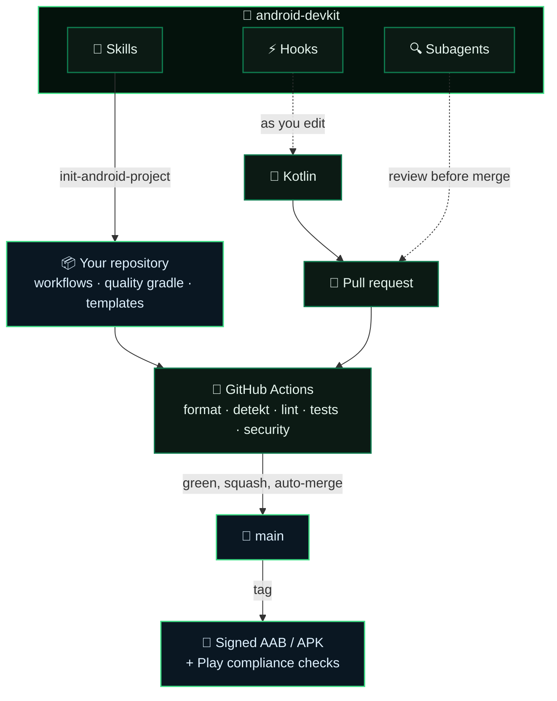

<div align="center">


# android-devkit

**Build Android apps to a shipping standard — with Claude Code.**

*A plugin marketplace: accessibility review, Play Store compliance, and event-driven CI/CD, wired into a repository in one command.*

<br>

[](https://docs.claude.com/en/docs/claude-code/plugins)
[](#-what-you-get)
[](.claude-plugin/marketplace.json)
[](https://github.com/SelfishCoconut/android-devkit/commits/main)
[](LICENSE)

[](https://developer.android.com)
[](https://kotlinlang.org)
[](https://developer.android.com/jetpack/compose)
[](https://gradle.org)
[](#-design-decisions)

[🚀 Install](#-install) • [🧰 What you get](#-what-you-get) • [🧩 How it works](#-how-it-works) • [🎛 Design decisions](#-design-decisions) • [🚧 Caveats](#-caveats) • [📜 License](#-license)

</div>

---

> [!NOTE]
> A Claude Code marketplace containing **one plugin**. It gives Claude the context to build Android
> apps to a shipping standard — accessibility treated as correctness, Play Store compliance checked
> before it costs a review cycle, and CI that runs on events rather than on a clock. Not affiliated
> with Google or Anthropic.

## 🚀 Install

```sh
# From a git remote
/plugin marketplace add SelfishCoconut/android-devkit
/plugin install android-devkit@android-devkit

# Or from a local checkout
/plugin marketplace add /path/to/android-devkit
/plugin install android-devkit@android-devkit
```

Then, in an Android project, ask Claude to run the **`init-android-project`** skill. It provisions
the whole GitHub setup and verifies CI actually runs before it reports success.

## 🧰 What you get

### Subagents

| | Purpose |
|---|---|
| **🔍 `a11y-reviewer`** | Accessibility review — labels, 48dp touch targets, contrast, font scaling, focus order, gesture alternatives. Treats accessibility defects as correctness defects. |
| **🩺 `codebase-sanity`** | Whole-repo longitudinal audit targeting AI-development rot: duplication, dead code, complexity creep, pattern inconsistency, architectural drift, test health. |
| **📚 `doc-curator`** | Documentation health — KDoc on public API, README and setup drift, diagram drift, and which release documents a diff just invalidated. |

### Skills

| | Purpose |
|---|---|
| **🏗 `init-android-project`** | One-shot provisioning: preflight permission checks, Gradle quality tooling, workflows, branch protection, auto-merge, labels, board — then verifies CI actually runs. |
| **▶️ `run`** | Build, install and drive the app on a device or emulator. Includes components with no launcher entry, log capture, and screenshots. |
| **🚢 `play-release`** | Google Play release: build config, signing, Data Safety, privacy policy, listing, and staged rollout. The part CI cannot check. |
| **🧱 `refactor`** | Prototype to production — pick a seam, characterize with tests, change in reversible steps. Keeps behavior-preserving and behavior-changing work in separate commits. |
| **🎨 `compose-ui`** | Jetpack Compose conventions: state hoisting, theming, sizing, accessibility, performance, previews. |
| **🌍 `i18n`** | String resources across locales — drift audits, hardcoded-string extraction, plurals, placeholders. |
| **📝 `feature-request`** | Plain-language request into a labeled, board-ready GitHub issue. |
| **📊 `progress-report`** | On-demand status summary from git, PRs, issues and CI. |
| **✨ `readme`** | Turn a repository front page into a landing page — centered hero, honest badges, emoji nav, feature tables, Mermaid diagrams, screenshot grids. Ships a skeleton to start from. |

### Hooks

| | Event | Behavior |
|---|---|---|
| **🎯 `format-on-edit`** | PostToolUse (Edit/Write) | Formats touched `.kt`/`.kts` with ktlint, or Gradle spotless if configured. |
| **🌍 `strings-sync`** | PostToolUse (Edit/Write) | Warns when `values/` and `values-*/` string keys drift. |
| **🔗 `remind-board-issue`** | PreToolUse (Bash) | On branch creation or `gh pr create`, requires the change to trace to an issue. |

All hooks are no-ops outside their target situation and never block a tool call.

## 🧩 How it works

The skills provision, the hooks catch mistakes while they are still cheap, and the subagents review
before anything merges:



<details>
<summary><b>What <code>init-android-project</code> installs</b></summary>

<br/>

```
.github/workflows/    ci · security · instrumented · release
                      playstore-check · metrics · board · automerge
.github/scripts/      play-compliance.sh — targetSdk floor, signing, versionCode,
                      debuggable/cleartext flags, permission inventory
.github/              issue templates (bug · feature · accessibility),
                      PR template, dependabot.yml
gradle/quality.gradle.kts   Spotless · detekt with baseline · Lint config
.claude/settings.json       the companion plugin set
```

</details>

## 🎛 Design decisions

**No `on: schedule` anywhere.** Every workflow runs on a push, a PR, a tag, or a manual dispatch.
Nothing runs unattended on a calendar. The one exception is Dependabot, which has no event-driven
mode by design — it answers "did the outside world change?", so it is set to `daily` and its PRs
auto-merge once CI passes.

**Squash-only, auto-merge.** `init-android-project` configures squash as the only merge method with
branch deletion on merge, and `automerge.yml` enables GitHub's native auto-merge on PRs labeled
`automerge` and on Dependabot PRs. Branch protection stays authoritative — the workflow never merges
anything itself.

**detekt with a baseline.** Existing debt is recorded so it does not block; new debt fails the
build. This is what makes the kit usable on an existing prototype rather than only on greenfield.

**Accessibility is not optional.** It has a dedicated reviewer, its own issue template, checklist
items in the PR template, and Lint's accessibility category is never disabled.

## 🚧 Caveats

> [!WARNING]
> Three of these will silently produce a half-working setup if skipped.

| | |
|---|---|
| **📌 Pinned action versions age** | Verify every `uses:` version before first use. `init-android-project` prompts for this — check them anyway. |
| **🔑 `board.yml` needs a `PROJECT_TOKEN`** | Plus a `PROJECT_URL` variable. The default `GITHUB_TOKEN` cannot write to a Projects v2 board. |
| **🔐 `release.yml` needs keystore secrets** | `KEYSTORE_BASE64`, `KEYSTORE_PASSWORD`, `KEY_ALIAS`, `KEY_PASSWORD`, and a matching `signingConfig`. Without them it builds unsigned. |
| **📅 The Play target-SDK floor rises annually** | `PLAY_TARGET_SDK_FLOOR` is a template variable for exactly that reason — check the current requirement rather than trusting the default. |

## 📜 License

[](LICENSE)

[Beerware](LICENSE), Revision 42 — do whatever you want with it. If we meet some day, and you think
this stuff is worth it, you can buy me a beer in return.

<div align="center">
<br/>
<sub>SelfishCoconut · built with <a href="https://claude.com/claude-code">Claude Code</a>.</sub>
</div>
