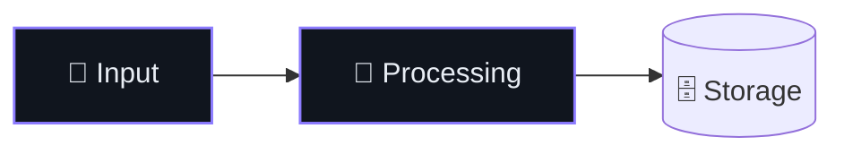

# README as a landing page

A GitHub README is the project's landing page, not its manual. Someone lands on it from a link and decides in about eight seconds whether this is worth their time. The job is to answer *what is this, does it work, is it maintained, how do I try it* before they scroll — and then let the people who kept reading go deep.

This skill produces the house style: a centered hero, badge rows that report real state, an emoji nav bar, tables and diagrams instead of paragraphs, and detail folded into `<details>` rather than deleted.

Start from `templates/README-skeleton.md` in this skill directory and cut what the project does not have. Never ship a section with placeholder text in it.

## Before writing anything

Read the repository first. A README written from the prompt instead of the code is how a repo ends up documenting a feature it does not have.

```sh
gh repo view --json name,description,url,licenseInfo,stargazerCount,topics
ls .github/workflows/                  # which badges can be real
git log --oneline -15                  # what actually shipped recently
ls docs/ media/ assets/ 2>/dev/null    # existing images, diagrams, docs to link
```

Establish these before drafting, and ask if you cannot determine them:

1. **The one sentence.** What it does, for whom — no adjectives. Everything else in the hero supports this sentence.
2. **The proof.** A screenshot, a GIF, a demo video, or an APK link. A project with a picture reads as real; a project without one reads as a plan.
3. **The status.** Prototype, thesis artefact, shipped app, library. Say it in the first alert block. Nothing erodes trust faster than a polished README for something that does not run.
4. **The accent colour.** One hex value used by every badge that is not a vendor logo. This single choice is most of what makes a README look designed.

## The hero

Everything above the first `---` is centered inside a raw HTML block. Markdown works inside it as long as blank lines separate the blocks.

```markdown
<div align="center">


# Project

**One line that says what it does.**

*A second line with the mechanism: the thing it reads → what it produces.*

<br>

[badge row 1 — project health]
[badge row 2 — tech stack]

[⚡ Features](#-features) • [📥 Install](#-install) • [🧩 How it works](#-how-it-works) • [🛠 Build](#-build)

<sub>Optional context line — affiliation, thesis, org.</sub>

</div>

---
```

A wordmark SVG at `width="760"` replaces the logo-plus-`# Title` pair when there is one. Otherwise keep the `#` heading — it is the accessible name of the page.

## Badges

Badges are a status dashboard, not decoration. Two rows at most, blank line between them:

- **Row one — health.** CI, security scan, docs build, release/version, last commit, license. These are what a stranger checks to decide if the project is alive.
- **Row two — stack.** Language, framework, notable libraries, coverage, type strictness.

```markdown
[](https://github.com/OWNER/REPO/actions/workflows/ci.yml)
[](https://github.com/OWNER/REPO/releases/latest)
[](https://github.com/OWNER/REPO/commits)
[](LICENSE)
```

Rules that matter more than the badges themselves:

- **Pick one `style` and never mix.** `flat-square` for a designed look, `flat` for the GitHub-native look. Mixing reads as unfinished.
- **Every badge links somewhere.** A CI badge links to its workflow, a version badge to the release, a stack badge to the docs or to `#` if there is nowhere honest to point.
- **Colour discipline.** Everything is the accent colour, *except* badges carrying a vendor logo, which use that vendor's brand colour (`Kotlin 7F52FF`, `Android 3DDC84`, `Python 3776AB`, `React 61DAFB`, `TypeScript 3178C6`). That contrast is the whole trick: a monochrome field with a few brand-coloured tiles.
- **Never fake a badge.** A hardcoded `coverage-92%` badge that no job produces is a lie with a shelf life. Use the workflow-status endpoint for anything CI computes, or omit it.
- **Dynamic ones only if the workflow exists.** Check `.github/workflows/` — a badge for a missing workflow renders as a grey `invalid` box.

## Nav bar

One line, emoji-prefixed, separated by ` • `, linking to the major sections. The trap: **GitHub strips the emoji from the heading anchor and keeps its hyphen**. `## ⚡ What it does` becomes `#-what-it-does`, not `#what-it-does`. Get this wrong and every nav link silently scrolls nowhere. Four to seven entries; more is a table of contents, which is a different, worse thing.

## Body sections

Tables and diagrams carry the content. Prose is for the ideas that do not fit in a cell.

**Feature table** — a bold emoji label on the left, one dense sentence on the right. Better than a bullet list because the eye can scan the left column alone:

```markdown
| | |
| --- | --- |
| **📥 Ingest anything** | What it accepts and what it does with it. |
| **🛑 Human in the loop** | The constraint that makes it trustworthy. |
```

**Architecture diagram** — a Mermaid `flowchart` showing how one real user action moves through the system. Emoji in node labels do the work of an icon set. Theme it with `classDef` so it does not render as default grey in a repo with an accent colour:

````markdown

````

Diagrams must survive both GitHub themes — pair dark fills with light `color:` text, and never rely on the default white background.

**Screenshots** — a markdown table for a uniform grid, an HTML `<table>` when the images need `width="100%"` cells and captions:

```markdown
<div align="center">

<br/><sub><b>Overview</b> — what the reader is looking at and why it matters.</sub>
</div>
```

Every image needs alt text that describes the content, not the filename. `alt="screenshot"` is the same as no alt text — and on this plugin's terms, an accessibility defect is a correctness defect.

**Alerts** — GitHub's callouts for the three things that need to interrupt reading:

```markdown
> [!NOTE]     scope and status — "a prototype, not a product"
> [!TIP]      where the real documentation lives
> [!WARNING]  safety, data loss, or a security-relevant caveat
```

**`<details>`** — the pressure valve. Anything a first-time reader does not need (module layout, alternative install paths, seeding data, backend configuration) goes in a collapsible with a bold `<summary>`. It keeps the page short without deleting the knowledge. Leave a blank line after `<summary>` or the markdown inside will not render.

**Closing** — license with its own badge, then a centered `<sub>` signature line. It ends the page deliberately instead of trailing off.

## Android projects

For an app repo, the hero proof is the app itself:

- **Screenshot row of three** at the top — the main screen, the distinguishing feature, the settings or detail view. Real device captures, not mockups.
- **Install badges**: Play Store, F-Droid, or a direct APK link to
  `https://github.com/OWNER/REPO/releases/latest/download/App.apk`.
- **``** — minSdk is the first thing a sideloader checks. Read it from `build.gradle.kts`, do not guess.
- **Stack badges** for Kotlin and Jetpack Compose, brand-coloured.
- A **module layout** block inside `<details>`, matching the real source tree.
- If the app has an accessibility story, it is a *feature*, not a footnote — put it in the feature table.

## Rules

- **Verify every claim against the repo.** Every command runs, every path exists, every link resolves, every version matches the build file. A README is the most-read file and the least-tested one.
- **Relative links for anything in-repo** (`LICENSE`, `docs/adr/`, `media/`) so forks and branches keep working.
- **Say what it does not do.** A short scope limit reads as confidence and stops the wrong bug reports.
- **Screenshots go in `media/` or `assets/`** — pick whichever the repo already uses.
- **Never invent metrics, stars, users, or a roadmap.** If it is not in the repo or the user's own words, it does not go in the README.
- **Cut before you add.** The best version of this style is short: hero, one picture, one table, one diagram, install, license. Length is not thoroughness.

Run the `doc-curator` agent afterwards when the README documents behavior — it checks the prose against what the code actually does now.
