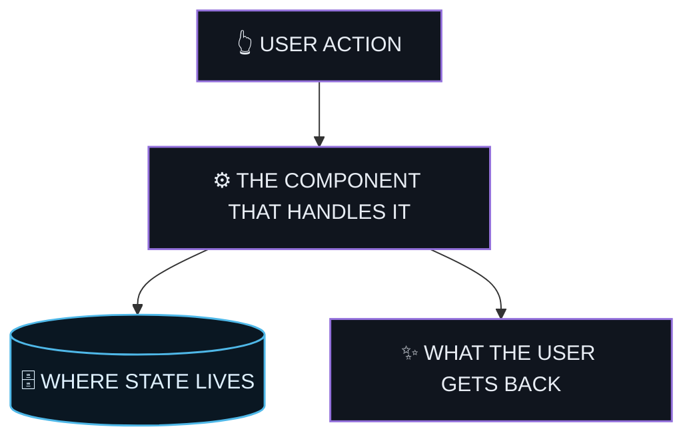

<!--
  README skeleton — house style.
  Replace every ALL-CAPS placeholder, then DELETE every section the project
  does not actually have. A section with placeholder text left in it is worse
  than no section. Delete this comment before committing.

  Accent colour: pick one hex and use it for every non-vendor badge below.
  Search-and-replace ACCENT with it (e.g. 8c7bff).
-->

<div align="center">


# PROJECT

**ONE LINE: WHAT IT DOES, FOR WHOM. NO ADJECTIVES.**

*A SECOND LINE WITH THE MECHANISM — WHAT IT READS → WHAT IT PRODUCES.*

<br>

[](https://github.com/OWNER/REPO/actions/workflows/ci.yml)
[](https://github.com/OWNER/REPO/releases/latest)
[](https://github.com/OWNER/REPO/commits)
[](LICENSE)
[](https://github.com/OWNER/REPO/stargazers)

[](https://kotlinlang.org)
[](#-install)
[](https://developer.android.com/jetpack/compose)

[⚡ Features](#-features) • [📥 Install](#-install) • [📸 Screenshots](#-screenshots) • [🧩 How it works](#-how-it-works) • [🛠 Build](#-build) • [📜 License](#-license)

<sub>OPTIONAL CONTEXT LINE — org, affiliation, thesis, funding.</sub>

</div>

---

> [!NOTE]
> STATUS IN ONE SENTENCE — prototype / shipped app / library — and the scope
> limit that stops the wrong expectations.

## ⚡ Features

<!-- Emoji-labelled left column, one dense sentence right. Scannable by the left column alone. -->

| | |
| --- | --- |
| **📥 FEATURE** | WHAT IT ACCEPTS AND WHAT IT DOES WITH IT. |
| **🧠 FEATURE** | THE INTERESTING MECHANISM, NOT THE MARKETING. |
| **♿ FEATURE** | ACCESSIBILITY, IF IT HAS A STORY — IT BELONGS HERE, NOT IN A FOOTNOTE. |

## 📥 Install

<!-- Android: store links first, then the sideload path. Delete what does not exist. -->

- 📦 **[Download the latest APK](https://github.com/OWNER/REPO/releases/latest/download/APP.apk)** — sideload on Android MINSDK+
- ▶️ **[Watch the demo](https://github.com/OWNER/REPO/releases/latest/download/demo.mp4)**

## 📸 Screenshots

<!-- Three real device captures: main screen, the distinguishing feature, settings/detail. -->

|  |  |  |
|:--:|:--:|:--:|
|  |  |  |
| CAPTION | CAPTION | CAPTION |

## 🧩 How it works

<!-- One real user action, traced through the system. Theme the classDefs to the accent colour. -->



<details>
<summary><b>Module layout</b></summary>

```
MODULE/     WHAT LIVES HERE
MODULE/     WHAT LIVES HERE
```

</details>

## 🛠 Build

> **Prerequisites:** LIST THEM — JDK, Android Studio version, SDK level.

```sh
./gradlew assembleDebug
./gradlew installDebug
```

<details>
<summary><b>Running the checks</b></summary>

```sh
./gradlew check          # format, static analysis, lint, unit tests
```

</details>

## 🧭 Roadmap

<!-- Only if there is a real one, tracked somewhere. Delete otherwise — an
     invented roadmap is a promise the repo did not make. -->

| Milestone | Theme | Status |
| --- | --- | --- |
| **M1** | THEME | ✅ `v0.1.0` |
| **M2** | THEME | 🚧 in progress |

## 📜 License

[](LICENSE)

LICENSE NAME — ONE LINE ON WHY, IF THE CHOICE WAS DELIBERATE.

<div align="center">
<br/>
<sub>AUTHOR · built with <a href="https://claude.com/claude-code">Claude Code</a>.</sub>
</div>
